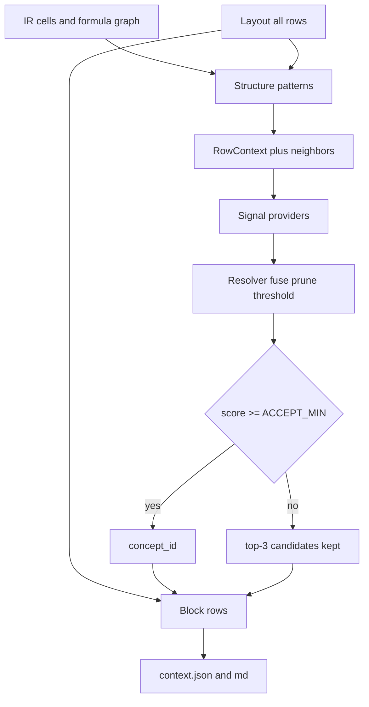

# Architecture

Operator guides (RU): [overview](overview.md), [layout](layout.md), [mapping](mapping.md), [taxonomy](taxonomy.md), [graph](graph.md), [llm](llm.md), [review](review.md).

Pipeline: `parse → compile → layout → mapping → graph → build → render`.

```mermaid
flowchart LR
  xlsx[source.xlsx] --> parse
  parse --> compile
  compile --> layout
  layout --> mapping
  mapping --> graph
  graph --> build
  build --> json[context.json]
  graph --> gjson[graph.json]
  gjson --> gmd[graph.md]
  json --> render
  render --> md[context.md]
  mapping -.-> llm[ChatPort / EmbedPort]
```

## Layers

1. **Raw** (`raw/cells.parquet`, `raw/cell_presence.parquet`, `raw/workbook.json`): cells, formulas, cached values, formats, comments, defined names, and every `<c>` marked `populated` or `styled_blank`. OOXML via lxml with zip-slip / bomb / encryption guards.
2. **Formulas** (`ir/cells.parquet`, `ir/edges.parquet`, `ir/cell_edges.parquet`, stamp `ir/compile.json`): templates, AST, formula-level edges, and expanded cell→cell edges (`dangling` / `dangling_reason` / `status` / `reason` / `evidence` / `range_ref` / `truncated`). `col_offset` and `period_lag` stay empty in `cell_edges`. Named ranges such as `DS_Drawn_C:DS_Drawn_N` stay unresolved. Unsupported formulas are marked `unparsed`. A range may repeat the sheet qualifier on the right (`SUM(TBA!$D$10:'TBA'!D10)`). Binary templates keep operator parentheses, e.g. `(1+Sub_Growth_M)^(R[-4]C[0]-1)`. A blank on a parsed sheet is `empty` / `actual_blank_cell`. A populated XML cell missing from the index is `parser_resolution_failure`.
3. **Layout** (`layout.json`): statement-like blocks, period axes (calendar years/dates **or** model-year indices `Y1..Yn`), or `params` blocks when there is no axis; grain, label span, row kinds, section path, and role-tagged non-period cells. Details: [layout.md](layout.md).
4. **Mapping** (`mapping.json`): entity linking with abstention. Signals propose candidates from label, section, ±2 neighbors, formula shape, and the IR edge graph; a resolver fuses, prunes by taxonomy facets, and maps only above a confidence threshold. Otherwise the row is `unknown` and may become a question. Top-3 candidates are always stored. LLM sees labels, section path, neighbors, and period headers — not numeric values. That ban is only the mapping chat. The observation in [llm.md](llm.md) is a different consumer.
5. **Graph** (`graph.json` and `graph.md`, schema `1.7.0`): summary plus one `links[]` record per formula cell (`cell`, A1 `formula` once, `formula_class`, `refs`, `row_key`, `period_id`). `formula_class` is one of `same_period`, `cross_period`, `aggregation`, `rollforward`, `conditional`, `hardcoded`. `row_key` and `period_id` are null outside layout. `SUM(J9:J12)` stays one range ref. `nodes` and `edges` are cell-level parquet counts, not `len(links)`. The summary also carries workbook `iterate`, cycle classes (`iterative_ok` vs `unexpected`) with optional `breakers`, `circularity_hints` when SCC is empty, and `dangling_classes`. Verified blanks (`empty_range_member`, `empty_ref`) are `node_type=empty` in `ir/graph_index.parquet` and are not `graph.dangling`; they are not members of `links`. Formula expansion stays in `ir/cell_edges.parquet` and is not rewritten by the graph stage. `col_offset` and `period_lag` are published in `ir/graph_edges.parquet`. Anchors and AST stay in `ir/cells.parquet`. Trace reads `graph_edges` and is ready only when `graph.json` exists. Trace is on demand: `GET /v1/context-jobs/{id}/graph/trace` and `GET .../graph/trace.md`. Details: [graph.md](graph.md). There is no `graph-edges.json`, `graph-dangling.json`, `formulas.json`, or `report.json`.
6. **Context** (`context.json`, schema `1.13.0`): canonical `ContextDocument`. `axes` is the only place for model phases (`period_key` with `phase` / `phase_year` / `flags` from 0/1 flag rows on the axis that contains those rows, or `calendar_year` on a calendar book). A FAST Start/End date ruler is that one axis: the period key comes from the end date, and each period may carry `start_date` / `end_date` (ISO). A column with only an end date (`Model_start`) is a `stub`, not a period. A later header whose formula points at the date row (`=YEAR(M7)`) aliases the same axis. A repeated year banner over a finer axis is `group_key` on that axis, not its own axis. A later section header with the same columns and keys reuses that axis. `context.json` omits a null phase, empty flags, and a calendar year that repeats the period key. Every layout row lives once inside its block (`blocks[].rows`): `row_key`, label, `label_path`, kind, `disposition`, `concept_id`, hints, candidates, one formula fingerprint, and `series` aligned to each `axis_id` (cached string or `null`). Flat `values` mirror the first series. `value_statuses` (`cached`, `empty`, `zero_explicit`, `not_applicable`) and `normalized_values` are flat lists of the same length. `scale_factor` is the numeric multiplier (`1`, `1000`, `1000000`, `1000000000`); `hints.scale` stays the token `unit` / `k` / `m` / `bn`. `period_position` and `aggregation` sit on the row next to `hints.time_semantics`. An empty operation line in a construction period is `not_applicable`; an explicit `0` stays `zero_explicit`. Abstract rows use `disposition=header`. Abstained and excluded rows are the same row with `disposition`, not a second catalog. There is no top-level `inventory`, `unmapped`, or `excluded`, and no per-cell `source` or `number_format`. `mapping_stats.concept_coverage` is the share of annotatable rows with an accepted concept. `mapping_stats.mapping_quality` scores label support, statement/cash semantics, unit, time, and formula text. `graph` is a pointer plus counts (`iterate`, `dangling`, `empty_range_members`). Phase is not copied onto `blocks[].periods`. `block.kind` is `timeline` or `params`; a params block stores column roles, not a second copy of the year axis. A downstream answer LLM does not read this document as a join problem. The prompt gets one observation (row × period): identity, the cached value as a string, unit hints, formula text, a short precedent list, a derived cell citation, and a copy of that axis period's `phase` / `phase_year` / `flags` / `group_key`. That projection is not written into schema `1.13.0`. Role cells carry `header` (Start, End, Live Case, Min). A numeric scalar left of the ruler is a `fact` with `period_position=instant` and `aggregation=none`. A total or stub column is not a period, so its graph link has `period_id=null`. Phase stays on `axes`, AST stays in `ir/cells.parquet`, and there is still no per-cell `source`. Contract: [llm.md](llm.md).
7. **Markdown** (`context.md`, `graph.md`): the same documents as the JSON, rendered as tables and lists. A row shows Unit, then Time (`stock/end/last`), then the formula. Period cells show the cached string; a scaled number also shows the base-unit amount (`1.5 (1500)`). `empty` and `n/a` are written out. `graph.md` adds a Class column on the links table. Do not merge cells, formula AST, or the dependency graph into either Markdown file. The context header reports **content completeness**, **concept coverage**, and **mapping quality**, then `## Axes` once per axis. The axis is one table with periods as columns: the header row is the axis id and the period keys (`| PF Model!r9 | 2021 | 2022 | 2032 |`), and `Start`, `End`, `Group`, `Phase`, `Phase year`, `Calendar`, and `Flags` are rows under it. A block table adds `Path` (`label_path`) and `Cells` (`L total: -86400`, `G Start: 01.01.2024`). A params scenario table prints `Live Case (L)` and `Case 1 (N)` as columns. An attribute row with no values is hidden, so a year axis without phases is the header alone. A regular month grid collapses to one column per year (`| Output!r6 | 2020 | 2021 |`, then `| Periods | 2020-01 .. 2020-12 | ... |`). A block with several axes lists `Axes:` and prints one value grid per series. Every block, every row, and every period value is included. Each row shows `row_key`. Period headers show the period key and column letter (`Y23 (AA)`, params `Values (D)`). Block `relations` are listed with the same `row_key`. Params blocks are `## Parameters / {sheet}`. There is no 16-column or 80-row cap, no `## Excluded` section, and no row navigator. `graph.md` repeats summary, empty-cell classes, cycles, circularity hints, and every link with `row_key` and `period_id`. Trace markdown repeats the trace nodes and edges.

## Layout row kinds

Each body row gets `kind` and `section_path` from structure, not from label dictionaries:

| kind | Meaning |
| --- | --- |
| `fact` | Period cells have numbers or formulas. Mapping candidates; period series in context. |
| `abstract` | Section header: label without period values. Parent of following facts; `disposition=header` on the block row. |
| `index` | Счётчик `Week #` / `Month #`: подряд `0\|1..n` по оси и лейбл счётчика, либо без формул в периодных ячейках. Kept on the block row. |
| `helper` | Check / tie-out / placeholder (`Spare`, `None`). `disposition=excluded`; values stay on the same row. |
| `flag` | Binary timing rows (≥90% of values in `{0, 1}`, or a `flag` token) and the params scenario **selector** (`Scenario Chosen`, `Live Case`). Price cases (`Mid case`, `Applied`) stay `fact`. `disposition=excluded`; not financial `unknown`. |

`needs_input` is driven only by questions on `fact` rows.

Weekly dates keep distinct `YYYY-MM-DD` keys. Grain `week` / `biweek` does not collapse them to months. Relative project-finance axes use keys `Y1` / `Q1` / `M1` / `P1` and grain `model_*`; they are not calendar keys. After context build, 0/1 flag rows attach to the axis whose rows contain them: `phase` is `construction` or `operation`, `phase_year` counts within a run, overlays such as repayment stay in `flags`. Week and biweek axes are not collapsed when keys repeat. Calendar books without those flags get `calendar_year` from the period key and `phase=null`. Flag rows stay excluded from concept mapping.

On a sheet, a short date pair that sits entirely left of the widest timeline is not a second block. Row labels are taken from a **span** of text columns left of the axis (not `min(col)`), so section headers in col 2 and articles in col 4 still become `abstract` + `fact`. Each `LayoutRow` may store its own `label_col` for provenance. Columns between the label span and the period axis are role-tagged (`total` / `unit` / `value`). Sheets without an axis become `params` or are rejected as prose/nav — they do not inflate completeness.

## Mapping

Details: [mapping.md](mapping.md). Taxonomy fields and how to extend them: [taxonomy.md](taxonomy.md).

Mapping is retrieve-and-align, not closed-set classification. Taxonomy is a dictionary; completeness of content does not depend on a hit. A wrong tag is worse than `unknown`.



### Signals

New matching ideas are new `Signal` implementations (`propose(ctx, book) -> list[Candidate]`), not new `if` branches per workbook.

| Signal | Role |
| --- | --- |
| `glossary` | Learned `(normalized_label, parent) → concept_id` from `data/glossary.json`. |
| `structure` | Formula graph: passthrough alias across sheets, `SUM` of child rows when **every** member is mapped (shared id or `broader`), inflows minus outflows, roll-forward, proration vs true ratio. Also ±2 neighbor labels and row-level dependents from `ir/cell_edges.parquet`, falling back to `ir/edges.parquet` (a line that feeds mapped `pnl.opex` / `cf.uses` gets a category prior). |
| `lexical` | Taxonomy labels and stable phrases. |
| `embed` | Dense retrieve over concept labels/definitions; accept only with cosine gap. |
| `chat` | Rerank a short pruned list. May return `unknown`. Never invents an id. |

Structure is the primary signal when formulas are unambiguous. Example: `Dashboard!C17 = Weekly_Forecast!C39` copies the source concept without calling the LLM. `Total Inflows = SUM(collections)` inherits `cf.receipts` as a total only when every SUM member is mapped, not `cf.net`.

### Facets and abstention

Concept fields, id families, and the “new meaning vs alias” rule: [taxonomy.md](taxonomy.md).

Concepts in [`taxonomy.yaml`](../src/finance_context/ontology/taxonomy.yaml) carry `definition`, `statements`, `value_kind` (`money` / `rate` / `ratio` / `count`), optional `role`, `broader`, `section_hints`, and `anti_labels`. Missing facets are filled from the id prefix. Division by a named constant or number is proration (still `money`). Lexical `patterns` may copy a section concept onto children (`cf.capex` under Uses); non-money assumptions must be listed in `unless`. `_semantic_ratio` matches **tokens**, not substrings. The row’s own label may mark `statement=cov` (`dscr` / `llcr` / `plcr`); a heading like DSCR does not reclassify a child `CFADS` line. A money cash-flow line cannot map to `ops.headcount` or `cov.llcr`. Covenant **limits** (`cov.dscr_limit`) are not the same id as observed DSCR.

Each mapped fact/flag/helper row stores `disposition`: `mapped`, `excluded` (check/helper/flag/noise), or `abstained` (`unknown` plus a question). Always-on **hints** (`nature`, `time_semantics` flow/bop/eop/rate/stock, `statement`, `unit` money/count/rate/years, `currency` GBP/EUR/USD/RUB (symbol, ISO, and local aliases: `pound`/`фунт`, `euro`/`евро`, `dollar`/`долл`, `руб`/`РУБ`), `scale` unit/k/m/bn, `sign` inflow/outflow/stock, `segment`, `escalation`) are written even when `concept_id` is null. `k£` in a label or Units cell is money+GBP+k, not `unit: null`. Rows also carry `context_role` and `secondary_concepts` (any Uses line → secondary `cf.uses`, any Sources line → `cf.sources`) without a second cascade winner. `semantic_identity`, `reporting_roles`, and `cash_semantics` separate economic meaning, statement or layout role, and accrual/cash/noncash. A selected `concept_id` is the reporting slot, not the whole meaning. Glossary honors the same `skip_concept` guards as lexical, so one learned label cannot force `pnl.revenue` onto CFS or `bs.equity` onto Sources. The params INDEX selector is `context_role=scenario_selector` (the block row keeps the index cell; it is not an assumption article). Check and flag rows do not create review questions. A wrong tag is still worse than `unknown`; thresholds are not lowered to force a nearest concept.

The resolver fuses scores, prunes incompatible facets, then accepts only above a threshold (stricter for embeddings). Empty or weak lists become `unknown` but keep top-3 `candidates`. Mapped rows store `evidence` (which signal, why). Calculation mismatch vs declared `calculations` is a **signed feature** (score down); it still abstains as `calculation_conflict` except a few keep-rules (exact `Cash Flow` under IRR/ratios).

Quality is two numbers, not one: **content completeness** (block rows vs layout rows, must be 1.0) and **concept coverage** (share of annotatable rows with an accepted id). **Selective risk** is errors among accepted mappings. Helpers live in `finance_context.mapping.eval`.

### Learned glossary

High-confidence `glossary` / `rule` / `structure` / `lexical` hits are merged into `DATA_DIR/glossary.json` after a job. The next workbook reuses them. Chat guesses are not stored. Taxonomy is edited when a **new meaning** appears (`bs.nwc`), not for every new label.

### Status

| Status | When |
| --- | --- |
| `succeeded` | No mapping questions. |
| `needs_input` | Questions remain on real fact rows (LLM/embed configured). |
| `degraded` | Questions remain and both LLM and embeddings are off. |

## Storage

`data/jobs/{job_id}/` on disk through `ArtifactStore`. Cross-job learned tags: `data/glossary.json`. Taxonomy embedding cache: `data/taxonomy_embeddings.npz`. Parquet is written with PyArrow. A run keeps the row lists it just built and reads `ir/*.parquet` again only on a later process, when `ir/compile.json` still matches. Swap the store adapter for object storage without changing the pipeline.

## API

Each accepted workbook starts a spawned process whose main thread runs the full pipeline. There is no thread pool and no shared mapping lock. `llm_concurrency` limits only that book. A second POST while that process is alive does not start another. A second POST of a finished workbook returns the snapshot. `?remap=1` stops the old process and starts a new one. Status comes from `meta.json` on disk. Do not run `uvicorn --workers` greater than 1: job processes are children of this API process. Statuses: `queued`, `running`, `succeeded`, `degraded`, `needs_input`, `failed`.
