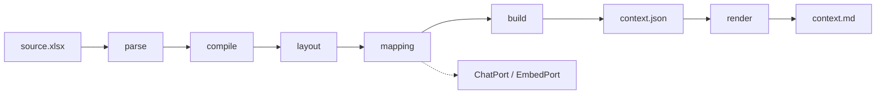
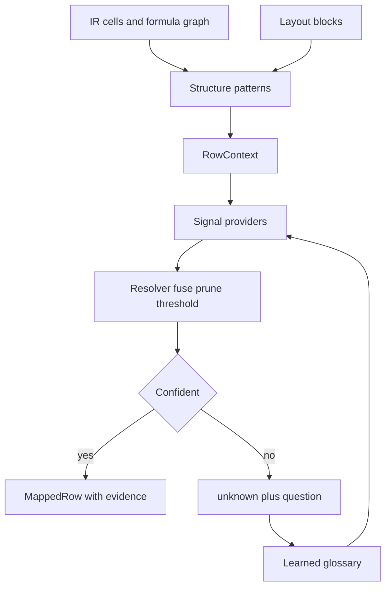

# Architecture

Operator guides (RU): [overview](overview.md), [layout](layout.md), [mapping](mapping.md), [taxonomy](taxonomy.md), [review](review.md).

Pipeline: `parse → compile → layout → mapping → build → render`.

## Layers

1. **Raw** (`raw/cells.parquet`, `raw/workbook.json`): cells, formulas, cached values, formats, comments, defined names. OOXML via lxml with zip-slip / bomb / encryption guards.
2. **Formulas** (`ir/cells.parquet`, `ir/edges.parquet`): templates, AST, dependency edges. Named ranges such as `DS_Drawn_C:DS_Drawn_N` stay unresolved. Unsupported formulas are marked `unparsed`. A range may repeat the sheet qualifier on the right (`SUM(TBA!$D$10:'TBA'!D10)`). Binary templates keep operator parentheses, e.g. `(1+Sub_Growth_M)^(R[-4]C[0]-1)`.
3. **Layout** (`layout.json`): statement-like blocks, period axes (calendar years/dates **or** model-year indices `Y1..Yn`), grain, label span, row kinds, and section path. Details: [layout.md](layout.md).
4. **Mapping** (`mapping.json`): entity linking with abstention. Signals propose candidates; a resolver fuses, prunes by taxonomy facets, and maps only above a confidence threshold. Otherwise the row is `unknown` and may become a question. LLM sees labels, section path, and period headers — not numeric values.
5. **Context** (`context.json`): canonical `ContextDocument` with provenance (`Sheet!A1`), mapping evidence, and structural relations (alias, aggregate, difference, roll-forward).
6. **Markdown** (`context.md`): deterministic human view. Mapped and unmapped fact rows use the same period tables (unmapped Concept is `unknown`). Default cap is 16 period columns and 80 rows per table; mapping evidence, questions, formula templates, and relations stay in JSON only.

## Layout row kinds

Each body row gets `kind` and `section_path` from structure, not from label dictionaries:

| kind | Meaning |
| --- | --- |
| `fact` | Period cells have numbers or formulas. Only these enter mapping and metrics. |
| `abstract` | Section header: label without period values. Becomes parent of following facts. |
| `index` | Счётчик `Week #` / `Month #`: подряд `0\|1..n` по оси и лейбл счётчика, либо без формул в периодных ячейках. |
| `helper` | Check / tie-out rows. |

`needs_input` is driven only by questions on `fact` rows.

Weekly dates keep distinct `YYYY-MM-DD` keys. Grain `week` / `biweek` does not collapse them to months. Relative project-finance axes use keys `Y1` / `Q1` / `M1` / `P1` and grain `model_*`; they are not calendar keys.

On a sheet, a short date pair that sits entirely left of the widest timeline is not a second block. Row labels are taken from a **span** of text columns left of the axis (not `min(col)`), so section headers in col 2 and articles in col 4 still become `abstract` + `fact`. Each `LayoutRow` may store its own `label_col` for provenance.

## Mapping

Details: [mapping.md](mapping.md). Taxonomy fields and how to extend them: [taxonomy.md](taxonomy.md).

Mapping is retrieve-and-align, not closed-set classification. A wrong tag is worse than `unknown`.

### Signals

New matching ideas are new `Signal` implementations (`propose(ctx, book) -> list[Candidate]`), not new `if` branches per workbook.

| Signal | Role |
| --- | --- |
| `glossary` | Learned `(normalized_label, parent) → concept_id` from `data/glossary.json`. |
| `structure` | Formula graph: passthrough alias across sheets, `SUM` of child rows when **every** member is mapped (shared id or `broader`), inflows minus outflows, roll-forward, proration vs true ratio. |
| `lexical` | Taxonomy labels and stable phrases. |
| `embed` | Dense retrieve over concept labels/definitions; accept only with cosine gap. |
| `chat` | Rerank a short pruned list. May return `unknown`. Never invents an id. |

Structure is the primary signal when formulas are unambiguous. Example: `Dashboard!C17 = Weekly_Forecast!C39` copies the source concept without calling the LLM. `Total Inflows = SUM(collections)` inherits `cf.receipts` as a total only when every SUM member is mapped, not `cf.net`.

### Facets and abstention

Concept fields, id families, and the “new meaning vs alias” rule: [taxonomy.md](taxonomy.md).

Concepts in [`taxonomy.yaml`](../src/finance_context/ontology/taxonomy.yaml) carry `definition`, `statements`, `value_kind` (`money` / `rate` / `ratio` / `count`), optional `role`, `broader`, `section_hints`, and `anti_labels`. Missing facets are filled from the id prefix. Division by a named constant or number is proration (still `money`). The row’s own label may mark `statement=cov` (`dscr` / `llcr` / `plcr`); a heading like DSCR does not reclassify a child `CFADS` line. A money cash-flow line cannot map to `ops.headcount` or `cov.llcr`.

Each mapped fact row stores `disposition`: `mapped`, `excluded` (check/helper/noise), or `abstained` (`unknown` plus a question). Check rows do not create review questions. A wrong tag is still worse than `unknown`; thresholds are not lowered to force a nearest concept.

The resolver fuses scores, prunes incompatible facets, then accepts only above a threshold (stricter for embeddings). Empty or weak lists become `unknown`. Mapped rows store `evidence` (which signal, why).

Quality is the pair **coverage** (share of fact rows mapped) and **selective risk** (errors among accepted mappings). Helpers live in `finance_context.mapping.eval`.

### Learned glossary

High-confidence `glossary` / `rule` / `structure` / `lexical` hits are merged into `DATA_DIR/glossary.json` after a job. The next workbook reuses them. Chat guesses are not stored. Taxonomy is edited when a **new meaning** appears (`bs.nwc`), not for every new label.

### Status

| Status | When |
| --- | --- |
| `succeeded` | No mapping questions. |
| `needs_input` | Questions remain on real fact rows (LLM/embed configured). |
| `degraded` | Questions remain and both LLM and embeddings are off. |

## Storage

`data/jobs/{job_id}/` on disk through `ArtifactStore`. Cross-job learned tags: `data/glossary.json`. Taxonomy embedding cache: `data/taxonomy_embeddings.npz`. Swap the store adapter for object storage without changing the pipeline.

## API

In-process asyncio queue for MVP. Statuses: `queued`, `running`, `succeeded`, `degraded`, `needs_input`, `failed`.
