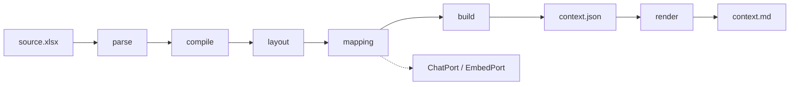

# Architecture

Pipeline: `parse → compile → layout → mapping → build → render`.

## Layers

1. **Raw** (`raw/cells.parquet`, `raw/workbook.json`): cells, formulas, cached values, formats, comments, defined names. OOXML via lxml with zip-slip / bomb / encryption guards.
2. **Formulas** (`ir/cells.parquet`, `ir/edges.parquet`): templates, AST, dependency edges. Unsupported formulas are marked `unparsed`.
3. **Layout** (`layout.json`): statement-like blocks, period axes, grain, row labels.
4. **Mapping** (`mapping.json`): taxonomy cascade glossary/rules → embeddings → structured LLM → unmapped. LLM sees labels and period headers, not numeric values.
5. **Context** (`context.json`): canonical `ContextDocument` with provenance (`Sheet!A1`) and confidence.
6. **Markdown** (`context.md`): deterministic human view; wide tables are truncated, JSON stays complete.

## Storage

`data/jobs/{job_id}/` on disk through `ArtifactStore`. Swap the adapter for object storage without changing the pipeline.

## API

In-process asyncio queue for MVP. Statuses: `queued`, `running`, `succeeded`, `degraded`, `needs_input`, `failed`.
