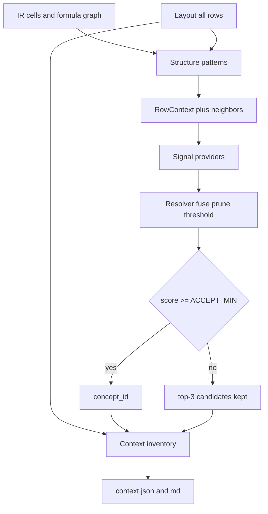

# Architecture

Operator guides (RU): [overview](overview.md), [layout](layout.md), [mapping](mapping.md), [taxonomy](taxonomy.md), [graph](graph.md), [review](review.md).

Pipeline: `parse → compile → layout → mapping → graph → build → render`.

```mermaid
flowchart LR
  xlsx[source.xlsx] --> parse
  parse --> compile
  compile --> layout
  layout --> mapping
  mapping --> graph
  graph --> build
  build --> json[context.json]
  graph --> gjson[graph.json]
  json --> render
  render --> md[context.md]
  mapping -.-> llm[ChatPort / EmbedPort]
```

## Layers

1. **Raw** (`raw/cells.parquet`, `raw/workbook.json`): cells, formulas, cached values, formats, comments, defined names. OOXML via lxml with zip-slip / bomb / encryption guards.
2. **Formulas** (`ir/cells.parquet`, `ir/edges.parquet`, `ir/cell_edges.parquet`): templates, AST, formula-level edges, and expanded cell→cell edges (`dangling` / `truncated`). Named ranges such as `DS_Drawn_C:DS_Drawn_N` stay unresolved. Unsupported formulas are marked `unparsed`. A range may repeat the sheet qualifier on the right (`SUM(TBA!$D$10:'TBA'!D10)`). Binary templates keep operator parentheses, e.g. `(1+Sub_Growth_M)^(R[-4]C[0]-1)`.
3. **Layout** (`layout.json`): statement-like blocks, period axes (calendar years/dates **or** model-year indices `Y1..Yn`), or `params` blocks when there is no axis; grain, label span, row kinds, section path, and role-tagged non-period cells. Details: [layout.md](layout.md).
4. **Mapping** (`mapping.json`): entity linking with abstention. Signals propose candidates from label, section, ±2 neighbors, formula shape, and the IR edge graph; a resolver fuses, prunes by taxonomy facets, and maps only above a confidence threshold. Otherwise the row is `unknown` and may become a question. Top-3 candidates are always stored. LLM sees labels, section path, neighbors, and period headers — not numeric values.
5. **Graph** (`graph.json`, `ir/graph_index.parquet`): cell-level formula graph of record. Index joins `period_id` / `row_key` / `concept_id`; `period_lag` and `col_offset` live on `cell_edges`. `graph.json` is stats and cycle classes (`iterative_ok` vs `unexpected`) only. Trace is `GET /v1/context-jobs/{id}/graph/trace`. Details: [graph.md](graph.md). There is no `report.json`.
6. **Context** (`context.json`, schema `1.4.0`): canonical `ContextDocument`. `timeline` is a workbook-level model calendar (`Y1…Yn` with `phase` / `phase_year` from 0/1 flag rows on the master relative axis, or `calendar_year` on a calendar book). `inventory` lists **every** layout row (kind, `label_path`, neighbors, formula fingerprint, hints, candidates, role-tagged cells). Abstract rows use `disposition=header`. `mapping_stats` reports content completeness and concept coverage; `unmapped` is abstained fact series, not inventory without `concept_id`. Period series live in `blocks` / `unmapped` / `excluded` as cached values plus source addresses — not formula text or adjacency. `graph` is a pointer plus counts. Matching `phase` / `phase_year` are copied onto `blocks[].periods`. `block.kind` is `timeline` or `params`.
7. **Markdown** (`context.md`): header reports **content completeness** vs **concept coverage**, then `## Timeline` when present. Timeline facts share period tables (unmapped Concept is `unknown`). Params blocks render as `## Parameters / {sheet}` (label, unit, value, scenarios, concept, ref). Then `## Excluded` and per-sheet `## Row navigator` (row, label, path, kind, concept, unit, formula fingerprint — no period values and no row-graph refs). Default cap is 16 period columns and 80 rows per table; mapping evidence, questions, and relations stay in JSON.

## Layout row kinds

Each body row gets `kind` and `section_path` from structure, not from label dictionaries:

| kind | Meaning |
| --- | --- |
| `fact` | Period cells have numbers or formulas. Mapping candidates; period series in context. |
| `abstract` | Section header: label without period values. Parent of following facts; kept in `inventory`. |
| `index` | Счётчик `Week #` / `Month #`: подряд `0\|1..n` по оси и лейбл счётчика, либо без формул в периодных ячейках. In `inventory` only. |
| `helper` | Check / tie-out / placeholder (`Spare`, `None`). Excluded from tagging; values stay in `excluded`. |
| `flag` | 0/1 timing and scenario rows (`Mid case`, `Live Case`, `Covenant breach`, …). Excluded; not financial `unknown`. |

`needs_input` is driven only by questions on `fact` rows.

Weekly dates keep distinct `YYYY-MM-DD` keys. Grain `week` / `biweek` does not collapse them to months. Relative project-finance axes use keys `Y1` / `Q1` / `M1` / `P1` and grain `model_*`; they are not calendar keys. After context build, 0/1 flag rows on the master relative axis (the `model_*` block with the most flags) become `context.timeline`: `phase` is `construction` or `operation`, `phase_year` counts within a run, overlays such as repayment stay in `flags`. Calendar books without those flags get `calendar_year` from the period key and `phase=null`. Flag rows stay excluded from concept mapping.

On a sheet, a short date pair that sits entirely left of the widest timeline is not a second block. Row labels are taken from a **span** of text columns left of the axis (not `min(col)`), so section headers in col 2 and articles in col 4 still become `abstract` + `fact`. Each `LayoutRow` may store its own `label_col` for provenance. Columns between the label span and the period axis are role-tagged (`total` / `unit` / `value`). Sheets without an axis become `params` or are rejected as prose/nav — they do not inflate completeness.

## Mapping

Details: [mapping.md](mapping.md). Taxonomy fields and how to extend them: [taxonomy.md](taxonomy.md).

Mapping is retrieve-and-align, not closed-set classification. Taxonomy is a dictionary; completeness of content does not depend on a hit. A wrong tag is worse than `unknown`.



### Signals

New matching ideas are new `Signal` implementations (`propose(ctx, book) -> list[Candidate]`), not new `if` branches per workbook.

| Signal | Role |
| --- | --- |
| `glossary` | Learned `(normalized_label, parent) → concept_id` from `data/glossary.json`. |
| `structure` | Formula graph: passthrough alias across sheets, `SUM` of child rows when **every** member is mapped (shared id or `broader`), inflows minus outflows, roll-forward, proration vs true ratio. Also ±2 neighbor labels and row-level dependents from `ir/edges.parquet` (a line that feeds mapped `pnl.opex` / `cf.uses` gets a category prior). |
| `lexical` | Taxonomy labels and stable phrases. |
| `embed` | Dense retrieve over concept labels/definitions; accept only with cosine gap. |
| `chat` | Rerank a short pruned list. May return `unknown`. Never invents an id. |

Structure is the primary signal when formulas are unambiguous. Example: `Dashboard!C17 = Weekly_Forecast!C39` copies the source concept without calling the LLM. `Total Inflows = SUM(collections)` inherits `cf.receipts` as a total only when every SUM member is mapped, not `cf.net`.

### Facets and abstention

Concept fields, id families, and the “new meaning vs alias” rule: [taxonomy.md](taxonomy.md).

Concepts in [`taxonomy.yaml`](../src/finance_context/ontology/taxonomy.yaml) carry `definition`, `statements`, `value_kind` (`money` / `rate` / `ratio` / `count`), optional `role`, `broader`, `section_hints`, and `anti_labels`. Missing facets are filled from the id prefix. Division by a named constant or number is proration (still `money`). Lexical `patterns` may copy a section concept onto children (`cf.capex` under Uses); non-money assumptions must be listed in `unless`. `_semantic_ratio` matches **tokens**, not substrings. The row’s own label may mark `statement=cov` (`dscr` / `llcr` / `plcr`); a heading like DSCR does not reclassify a child `CFADS` line. A money cash-flow line cannot map to `ops.headcount` or `cov.llcr`. Covenant **limits** (`cov.dscr_limit`) are not the same id as observed DSCR.

Each mapped fact/flag/helper row stores `disposition`: `mapped`, `excluded` (check/helper/flag/noise), or `abstained` (`unknown` plus a question). Always-on **hints** (`nature`, `time_semantics` flow/bop/eop/rate, `statement`, `unit`) are written even when `concept_id` is null. Check and flag rows do not create review questions. A wrong tag is still worse than `unknown`; thresholds are not lowered to force a nearest concept.

The resolver fuses scores, prunes incompatible facets, then accepts only above a threshold (stricter for embeddings). Empty or weak lists become `unknown` but keep top-3 `candidates`. Mapped rows store `evidence` (which signal, why). Calculation mismatch vs declared `calculations` is a **signed feature** (score down); it still abstains as `calculation_conflict` except a few keep-rules (exact `Cash Flow` under IRR/ratios).

Quality is two numbers, not one: **content completeness** (`inventory` vs layout rows, must be 1.0) and **concept coverage** (share of annotatable rows with an accepted id). **Selective risk** is errors among accepted mappings. Helpers live in `finance_context.mapping.eval`.

### Learned glossary

High-confidence `glossary` / `rule` / `structure` / `lexical` hits are merged into `DATA_DIR/glossary.json` after a job. The next workbook reuses them. Chat guesses are not stored. Taxonomy is edited when a **new meaning** appears (`bs.nwc`), not for every new label.

### Status

| Status | When |
| --- | --- |
| `succeeded` | No mapping questions. |
| `needs_input` | Questions remain on real fact rows (LLM/embed configured). |
| `degraded` | Questions remain and both LLM and embeddings are off. |

## Storage

`data/jobs/{job_id}/` on disk through `ArtifactStore`. Cross-job learned tags: `data/glossary.json`. Taxonomy embedding cache: `data/taxonomy_embeddings.npz`. Swap the store adapter for object storage without changing the pipeline.

## API

In-process asyncio queue for MVP. Statuses: `queued`, `running`, `succeeded`, `degraded`, `needs_input`, `failed`.
