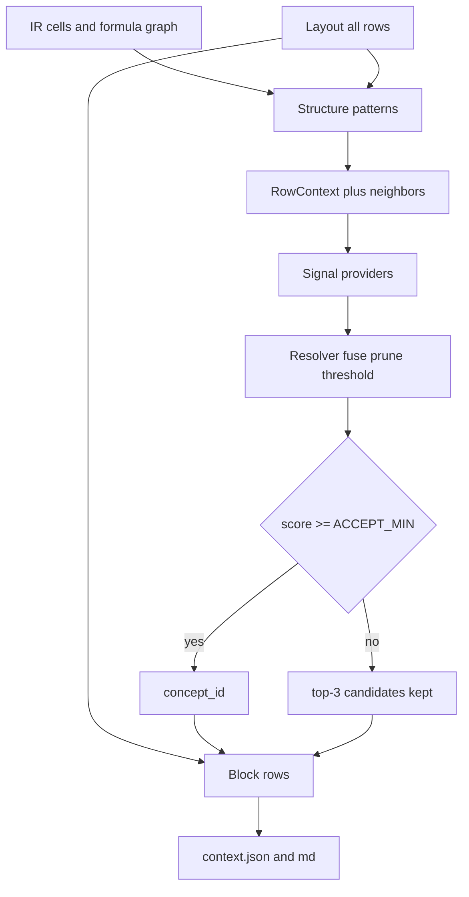

# Архитектура

**Русский** · [English](../en/architecture.md)

Гайды: [обзор](overview.md), [layout](layout.md), [маппинг](mapping.md), [таксономия](taxonomy.md), [граф](graph.md), [срез для LLM](llm.md), [разбор unmapped](review.md).

Пайплайн: `parse → compile → layout → mapping → graph → build → render`.

```mermaid
flowchart LR
  xlsx[source.xlsx] --> parse
  parse --> compile
  compile --> layout
  layout --> mapping
  mapping --> graph
  graph --> build
  build --> json[context.json]
  graph --> gjson[graph.json]
  gjson --> gmd[graph.md]
  json --> render
  render --> md[context.md]
  mapping -.-> llm[ChatPort / EmbedPort]
```

## Слои

1. **Raw** (`raw/cells.parquet`, `raw/cell_presence.parquet`, `raw/workbook.json`): ячейки, формулы, кэш, форматы, комментарии, defined names и каждый `<c>` с меткой `populated` или `styled_blank`. OOXML через lxml, с защитой от zip-slip, zip-bomb и шифрования.
2. **Formulas** (`ir/cells.parquet`, `ir/edges.parquet`, `ir/cell_edges.parquet`, штамп `ir/compile.json`): шаблоны, AST, рёбра уровня формулы и развёрнутые рёбра cell→cell (`dangling` / `dangling_reason` / `status` / `reason` / `evidence` / `range_ref` / `truncated`). В `cell_edges` `col_offset` и `period_lag` остаются пустыми. Именованные диапазоны вроде `DS_Drawn_C:DS_Drawn_N` не разрешаются. Неподдерживаемые формулы помечаются `unparsed`. У диапазона квалификатор листа может повториться справа (`SUM(TBA!$D$10:'TBA'!D10)`). Бинарные шаблоны сохраняют скобки операторов, например `(1+Sub_Growth_M)^(R[-4]C[0]-1)`. Пустая ячейка на разобранном листе — `empty` / `actual_blank_cell`. Заполненная XML-ячейка, которой нет в индексе, — `parser_resolution_failure`.
3. **Layout** (`layout.json`): блоки отчётов, оси периодов (календарные годы/даты **или** индексы модельных лет `Y1..Yn`) либо блоки `params`, если оси нет; зерно, span лейблов, виды строк, путь секции и role-ячейки вне периодов. Подробности: [layout.md](layout.md).
4. **Mapping** (`mapping.json`): связывание сущностей с правом отказаться. Сигналы предлагают кандидатов по лейблу, секции, соседям ±2, форме формулы и графу рёбер IR; резолвер сливает, отсекает по фасетам таксономии и принимает только выше порога уверенности. Иначе строка — `unknown` и может стать вопросом. Top-3 кандидатов сохраняются всегда. LLM видит лейблы, путь секции, соседей и заголовки периодов — не числа. Этот запрет только у чата маппинга. Наблюдение в [llm.md](llm.md) — другой потребитель.
5. **Graph** (`graph.json` и `graph.md`, схема `1.7.0`): сводка плюс одна запись `links[]` на ячейку с формулой (`cell`, A1 `formula` один раз, `formula_class`, `refs`, `row_key`, `period_id`). `formula_class` — одно из `same_period`, `cross_period`, `aggregation`, `rollforward`, `conditional`, `hardcoded`. Вне layout `row_key` и `period_id` равны null. `SUM(J9:J12)` остаётся одной ссылкой на диапазон. `nodes` и `edges` — размеры cell-level parquet, не `len(links)`. В сводке также `iterate` книги, классы циклов (`iterative_ok` против `unexpected`) с необязательными `breakers`, `circularity_hints`, если SCC пуст, и `dangling_classes`. Проверенные пустые ячейки (`empty_range_member`, `empty_ref`) имеют `node_type=empty` в `ir/graph_index.parquet` и не входят в `graph.dangling` и в `links`. Развёртка формул остаётся в `ir/cell_edges.parquet`, стадия graph её не переписывает. `col_offset` и `period_lag` публикуются в `ir/graph_edges.parquet`. Якоря и AST остаются в `ir/cells.parquet`. Trace читает `graph_edges` и готов только когда есть `graph.json`. Trace по запросу: `GET /v1/context-jobs/{id}/graph/trace` и `GET .../graph/trace.md`. Подробности: [graph.md](graph.md). Файлов `graph-edges.json`, `graph-dangling.json`, `formulas.json` и `report.json` нет.
6. **Context** (`context.json`, схема `1.13.0`): канонический `ContextDocument`. Фазы модели живут только в `axes` (`period_key` с `phase` / `phase_year` / `flags` из 0/1 flag-строк на той оси, в чьих строках они лежат, либо `calendar_year` у календарной книги). Линейка дат FAST Start/End — эта одна ось: ключ периода берётся из end date, у периода могут быть `start_date` / `end_date` (ISO). Колонка только с end date (`Model_start`) — `stub`, не период. Более поздняя шапка, чья формула указывает на строку дат (`=YEAR(M7)`), — alias той же оси. Повторённый год над более мелкой осью — `group_key` этой оси, не отдельная ось. Шапка следующей секции с теми же колонками и ключами переиспользует эту ось. `context.json` не пишет пустую `phase`, пустой `flags` и `calendar_year`, если год уже в ключе. Каждая строка layout живёт один раз в своём блоке (`blocks[].rows`): `row_key`, лейбл, `label_path`, kind, `disposition`, `concept_id`, hints, кандидаты, один fingerprint формулы и `series` по каждому `axis_id` (строка кэша или `null`). Плоский `values` повторяет первую серию. `value_statuses` (`cached`, `empty`, `zero_explicit`, `not_applicable`) и `normalized_values` — плоские списки той же длины. `scale_factor` — числовой множитель (`1`, `1000`, `1000000`, `1000000000`); `hints.scale` остаётся токеном `unit` / `k` / `m` / `bn`. `period_position` и `aggregation` лежат на строке рядом с `hints.time_semantics`. Пустая операционная строка в периоде construction — `not_applicable`; явный `0` остаётся `zero_explicit`. Abstract-строки получают `disposition=header`. Abstained и excluded — та же строка с `disposition`, не второй каталог. Верхних `inventory`, `unmapped`, `excluded` нет, как и per-cell `source` и `number_format`. `mapping_stats.concept_coverage` — доля annotatable-строк с принятым концептом. `mapping_stats.mapping_quality` оценивает поддержку лейбла, семантику отчёта/денег, единицы, время и текст формулы. `graph` — pointer плюс счётчики (`iterate`, `dangling`, `empty_range_members`). Фаза не копируется в `blocks[].periods`. `block.kind` — `timeline` или `params`; params-блок хранит роли колонок, не вторую копию оси лет. Отвечающая LLM не читает этот документ как задачу на join. В промпт попадает одно наблюдение (строка × период): идентичность, кэш строкой, hints единиц, текст формулы, короткий список прецедентов, выведенная цитата ячейки и копия `phase` / `phase_year` / `flags` / `group_key` этого периода оси. Эта проекция в схему `1.13.0` не пишется. У role-ячеек есть `header` (Start, End, Live Case, Min). Числовой скаляр слева от линейки — `fact` с `period_position=instant` и `aggregation=none`. Колонка total или stub — не период, поэтому у её link `period_id=null`. Фаза остаётся в `axes`, AST — в `ir/cells.parquet`, per-cell `source` по-прежнему нет. Контракт: [llm.md](llm.md).
7. **Markdown** (`context.md`, `graph.md`): те же документы, что JSON, таблицами и списками. Строка показывает Unit, затем Time (`stock/end/last`), затем формулу. Ячейки периодов показывают строку кэша и под ней адрес ячейки (`Sheet!A1`); у масштабированного числа рядом базовая величина (`1.5 (1500)`). `empty` и `n/a` печатаются явно. В `graph.md` у таблицы links есть колонка Class. Ячейки, AST формул и граф зависимостей в эти Markdown не сливаются. Шапка context сообщает **content completeness**, **concept coverage** и **mapping quality**, затем `## Axes` по одному разу на ось. Ось — одна таблица, периоды колонками: строка шапки — id оси и ключи периодов (`| PF Model!r9 | 2021 | 2022 | 2032 |`), под ней строки `Start`, `End`, `Group`, `Phase`, `Phase year`, `Calendar`, `Flags`. Таблица блока добавляет `Path` (`label_path`) и `Cells` (`L total: -86400`, `G Start: 01.01.2024`). Таблица сценариев params печатает `Live Case (L)` и `Case 1 (N)` колонками. Строка атрибута без значений скрыта, поэтому ось лет без фаз — только шапка. Ровная месячная сетка сжимается до колонки на год (`| Output!r6 | 2020 | 2021 |`, затем `| Periods | 2020-01 .. 2020-12 | ... |`). Блок с несколькими осями пишет `Axes:` и одну сетку значений на серию. Входят все блоки, все строки и все значения периодов. У каждой строки есть `row_key`. Заголовок периода — ключ и буква колонки (`Y23 (AA)`, у params `Values (D)`). `relations` блока перечисляются теми же `row_key`. Блоки params — `## Parameters / {sheet}`. Потолка в 16 колонок или 80 строк нет, секции `## Excluded` нет, навигатора строк нет. `graph.md` повторяет сводку, классы пустых ячеек, циклы, circularity hints и каждый link с `row_key` и `period_id`. Markdown trace повторяет узлы и рёбра trace.

## Виды строк layout

У строки тела `kind` и `section_path` берутся из структуры, не из словаря лейблов:

| kind | Смысл |
| --- | --- |
| `fact` | В периодных ячейках числа или формулы. Кандидаты маппинга; серия периодов в context. |
| `abstract` | Заголовок секции: лейбл без значений по периодам. Родитель следующих fact; на строке блока `disposition=header`. |
| `index` | Счётчик `Week #` / `Month #`: подряд `0\|1..n` по оси и лейбл счётчика, либо в периодных ячейках нет формул. Остаётся строкой блока. |
| `helper` | Check / tie-out / плейсхолдер (`Spare`, `None`). `disposition=excluded`; значения остаются на той же строке. |
| `flag` | Бинарный тайминг (≥90% значений в `{0, 1}` или токен `flag`) и **селектор** сценария params (`Scenario Chosen`, `Live Case`). Ценовые кейсы (`Mid case`, `Applied`) остаются `fact`. `disposition=excluded`; это не финансовый `unknown`. |

`needs_input` считается только по вопросам на строках `fact`.

Недельные даты сохраняют разные ключи `YYYY-MM-DD`. Зерно `week` / `biweek` не схлопывает их в месяцы. Относительные оси project finance используют ключи `Y1` / `Q1` / `M1` / `P1` и зерно `model_*`; это не календарные ключи. После сборки context 0/1 flag-строки вешаются на ту ось, в чьих строках они лежат: `phase` — `construction` или `operation`, `phase_year` считает внутри run, оверлеи вроде repayment остаются в `flags`. Недельные и двухнедельные оси не схлопываются из-за повтора ключа. Календарная книга без таких флагов получает `calendar_year` из ключа периода и `phase=null`. Flag-строки по-прежнему excluded из маппинга концептов.

На листе короткая пара дат целиком левее самого широкого таймлайна — не второй блок. Лейблы строк берутся из **span** текстовых колонок левее оси (не `min(col)`), поэтому заголовки секций в col 2 и статьи в col 4 всё равно становятся `abstract` + `fact`. У `LayoutRow` может быть свой `label_col` для происхождения. Колонки между span лейбла и осью периодов получают роли (`total` / `unit` / `value`). Лист без оси становится `params` или отбрасывается как проза/навигация — в completeness он не входит.

## Маппинг

Подробности: [mapping.md](mapping.md). Поля таксономии и как их расширять: [taxonomy.md](taxonomy.md).

Маппинг — retrieve-and-align, не классификация на закрытом множестве. Таксономия — словарь; полнота контента не зависит от попадания. Неверный тег хуже `unknown`.



### Сигналы

Новая идея совпадения — новая реализация `Signal` (`propose(ctx, book) -> list[Candidate]`), не новая ветка `if` на книгу.

| Сигнал | Роль |
| --- | --- |
| `glossary` | Выученная пара `(normalized_label, parent) → concept_id` из `data/glossary.json`. |
| `structure` | Граф формул: alias-копия между листами, `SUM` дочерних строк, когда замаплен **каждый** член (общий id или `broader`), поступления минус выплаты, roll-forward, proration против настоящего ratio. Также лейблы соседей ±2 и dependents уровня строки из `ir/cell_edges.parquet`, с запасным `ir/edges.parquet` (строка, которая питает уже замапленные `pnl.opex` / `cf.uses`, получает prior категории). |
| `lexical` | Лейблы таксономии и устойчивые фразы. |
| `embed` | Dense retrieve по лейблам и определениям концептов; принятие только при cosine gap. |
| `chat` | Rerank короткого обрезанного списка. Может вернуть `unknown`. Id не изобретает. |

Structure — главный сигнал, когда формула однозначна. Пример: `Dashboard!C17 = Weekly_Forecast!C39` копирует концепт источника без LLM. `Total Inflows = SUM(collections)` наследует `cf.receipts` как итог, только если замаплен каждый член SUM, и не становится `cf.net`.

### Фасеты и отказ

Поля концепта, семейства id и правило «новый смысл или alias»: [taxonomy.md](taxonomy.md).

Концепты в [`taxonomy.yaml`](../../src/finance_context/ontology/taxonomy.yaml) несут `definition`, `statements`, `value_kind` (`money` / `rate` / `ratio` / `count`), необязательные `role`, `broader`, `section_hints` и `anti_labels`. Пустые фасеты заполняются из префикса id. Деление на именованную константу или число — proration (по-прежнему `money`). Lexical `patterns` может скопировать концепт секции на детей (`cf.capex` под Uses); неденежные допущения надо перечислить в `unless`. `_semantic_ratio` смотрит **токены**, не подстроки. Свой лейбл строки может поставить `statement=cov` (`dscr` / `llcr` / `plcr`); заголовок вроде DSCR не переклассифицирует дочернюю строку `CFADS`. Денежная строка cash-flow не мапится на `ops.headcount` или `cov.llcr`. **Пороги** ковенанта (`cov.dscr_limit`) — не тот же id, что наблюдённый DSCR.

У каждой замапленной строки fact/flag/helper есть `disposition`: `mapped`, `excluded` (check/helper/flag/noise) или `abstained` (`unknown` плюс вопрос). **Hints** пишутся всегда (`nature`, `time_semantics` flow/bop/eop/rate/stock, `statement`, `unit` money/count/rate/years, `currency` GBP/EUR/USD/RUB (символ, ISO и локальные алиасы: `pound`/`фунт`, `euro`/`евро`, `dollar`/`долл`, `руб`/`РУБ`), `scale` unit/k/m/bn, `sign` inflow/outflow/stock, `segment`, `escalation`), даже если `concept_id` равен null. `k£` в лейбле или ячейке Units — money+GBP+k, не `unit: null`. У строк также `context_role` и `secondary_concepts` (любая строка Uses → вторичный `cf.uses`, любая строка Sources → `cf.sources`) без второго победителя каскада. `semantic_identity`, `reporting_roles` и `cash_semantics` разделяют экономический смысл, роль отчёта или layout и accrual/cash/noncash. Выбранный `concept_id` — отчётный слот, не весь смысл. Glossary соблюдает те же guards `skip_concept`, что lexical, поэтому один выученный лейбл не может навязать `pnl.revenue` на CFS или `bs.equity` на Sources. Селектор INDEX в params — `context_role=scenario_selector` (строка блока хранит ячейку индекса; это не статья допущения). Check и flag вопросов на разбор не создают. Неверный тег по-прежнему хуже `unknown`; пороги не снижают, чтобы взять ближайший концепт.

Резолвер сливает score, отсекает несовместимые фасеты и принимает только выше порога (для эмбеддингов порог жёстче). Пустой или слабый список становится `unknown`, но top-3 `candidates` остаются. У замапленных строк есть `evidence` (какой сигнал и почему). Расхождение с объявленными `calculations` — **знаковый признак** (score вниз); отказ `calculation_conflict` всё равно остаётся, кроме нескольких keep-rule (точный `Cash Flow` под IRR/ratios).

Качество — два числа, не одно: **content completeness** (строки блоков против строк layout, должно быть 1.0) и **concept coverage** (доля annotatable-строк с принятым id). **Selective risk** — ошибки среди принятых маппингов. Хелперы живут в `finance_context.mapping.eval`.

### Выученный glossary

High-confidence попадания `glossary` / `rule` / `structure` / `lexical` после джоба дописываются в `DATA_DIR/glossary.json`. Следующая книга их переиспользует. Догадки chat не сохраняются. Таксономию правят, когда появляется **новый смысл** (`bs.nwc`), а не на каждый новый лейбл.

### Статус

| Статус | Когда |
| --- | --- |
| `succeeded` | Вопросов маппинга нет. |
| `needs_input` | Вопросы остались на настоящих fact-строках (LLM/embed настроены). |
| `degraded` | Вопросы остались, а LLM и эмбеддинги оба выключены. |

## Хранение

`data/jobs/{job_id}/` на диске через `ArtifactStore`. Выученные теги между джобами: `data/glossary.json`. Кэш эмбеддингов таксономии: `data/taxonomy_embeddings.npz`. Parquet пишет PyArrow. Прогон держит только что собранные списки строк и читает `ir/*.parquet` снова только в другом процессе, когда `ir/compile.json` всё ещё совпадает. Адаптер хранилища можно заменить на object storage, не меняя пайплайн.

## API

Каждая принятая книга стартует в spawned-процессе, чей главный поток считает весь пайплайн. Дочерний процесс вызывает тот же `configure_logging`, поэтому `stage_done`, `job_reuse` и пропуски моделей видны в stdout контейнера. Повторный POST готовой книги пишет `job_reuse` и процесс не стартует. API пишет `http_start` и `http_done` на каждый запрос, кроме `/healthz`. `finance-context build` остаётся одним процессом. Пула потоков и общего замка на mapping нет. `llm_concurrency` ограничивает только эту книгу. Второй POST, пока процесс жив, другой процесс не стартует. Второй POST готовой книги отдаёт снимок. `?remap=1` останавливает старый процесс и стартует новый. Статус берётся из `meta.json` на диске. Поле `queue` у `GET /readyz` равно `in_process`: список джобов живёт в этом процессе API. Не запускайте `uvicorn --workers` больше 1: процессы книг — дети этого процесса API. Статусы: `queued`, `running`, `succeeded`, `degraded`, `needs_input`, `failed`.

`scripts/run.sh` только опрашивает HTTP. Его `JOB_TIMEOUT_SEC` по умолчанию 300, если переменная не задана, и дочерний процесс не останавливает. Сервер останавливает дочерний процесс по Settings `job_timeout_sec` (дефолт 3600, часто задан в `.env`). `scripts/check-graph.py` проверяет схему `1.7` у графа и `1.13` у context.
